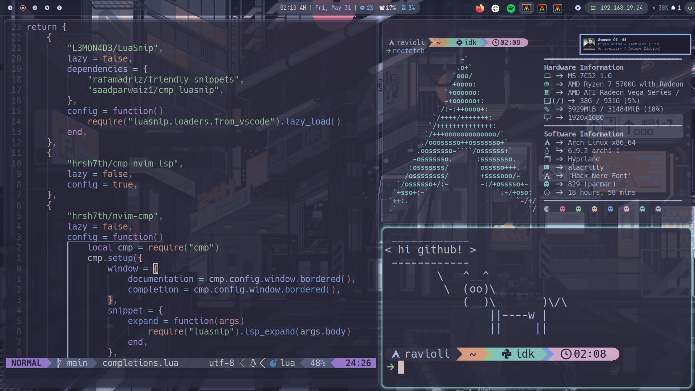
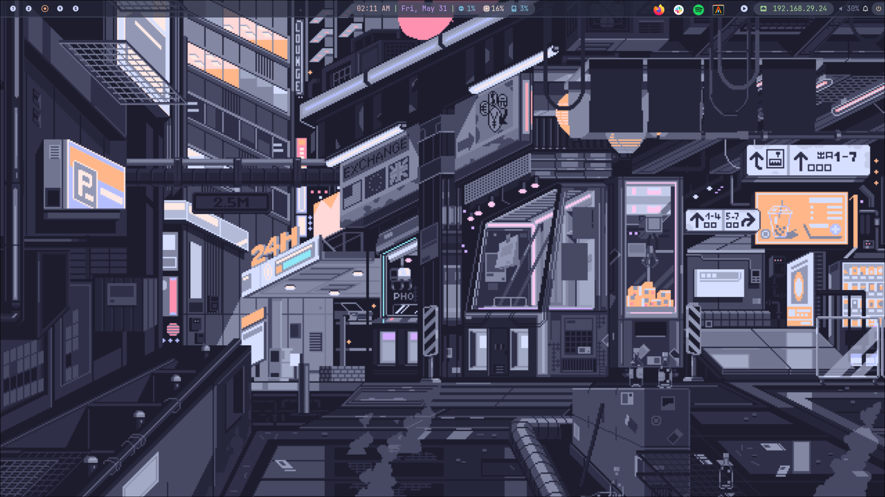
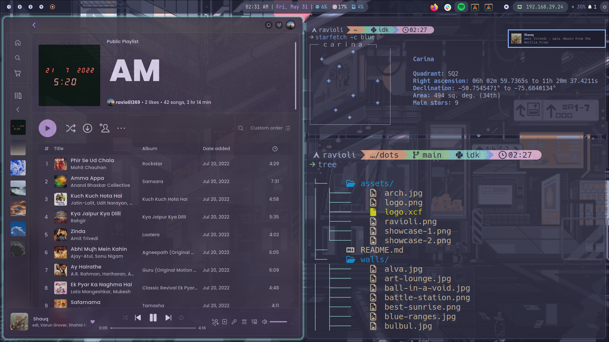

<div align="center"></div>
<h1 align="center">Arch (btw) & Hyprland + Catppuccin Mocha</h1>

<div align="center">


</div>






## requirements 

- git
- stow

## installation

First, check out the dotfiles repo in your $HOME directory using git

```
$ git clone git@github.com/ravioli1369/dots.git
$ cd dots
```

then use GNU stow to create symlinks

```
$ stow .
```

## acknowledgements
this rice is based on the NixOS Hyperland config of [XNM1](https://github.com/XNM1/linux-nixos-hyprland-config-dotfiles).
wallpapers were taken from [accmeboot](https://github.com/accmeboot/dotfiles) and [l6174](https://github.com/l6174/hyprdots)'s repos along with a good chunck of images i've collected or shot myself over the years.
